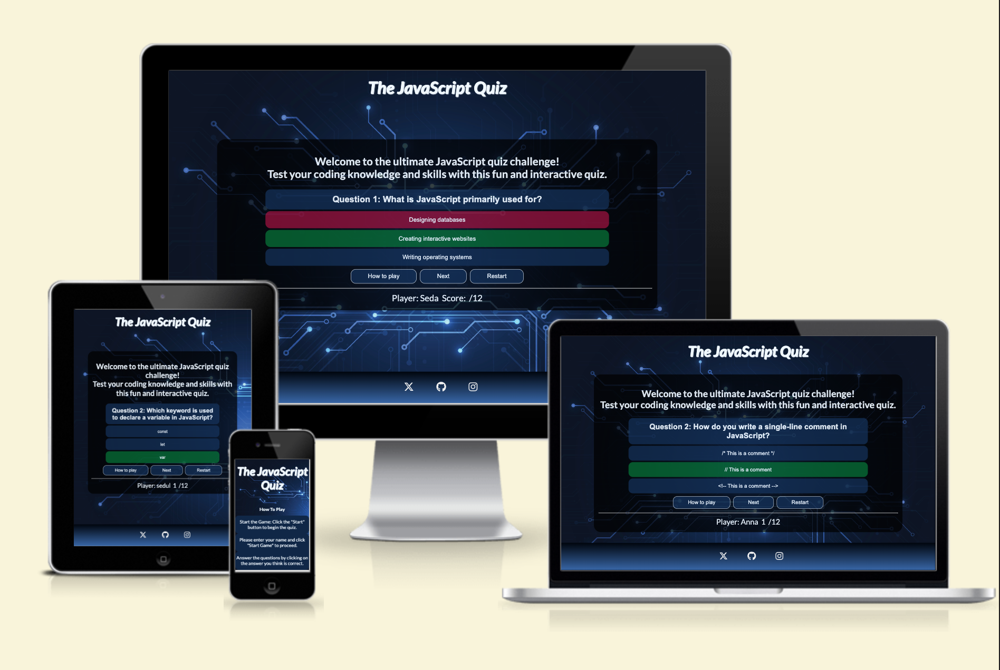
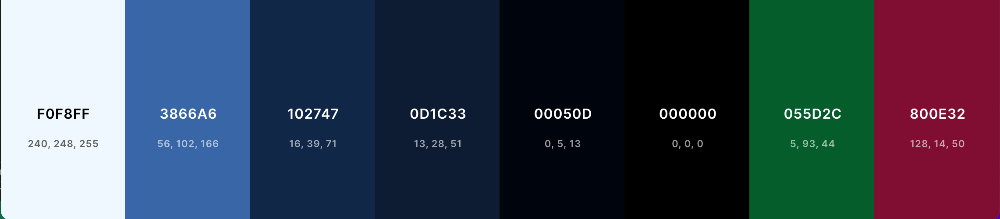
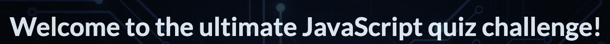

# JS Quiz

Visit the deployed site: [The JS-Quiz ](https://ann-anahit.github.io/JS-Quiz/)

The JS Quiz is a fun and educational JavaScript Quiz Game for students. Are you a student eager to delve into the world of JavaScript programming? Look no further than "JS-Quiz" – a captivating quiz game designed to make learning JavaScript both enjoyable and interactive. Say goodbye to dull textbooks and hello to a fun-filled learning adventure. With JS-Quiz, learning JavaScript becomes an exciting quest rather than a tedious chore.
Embark on your JavaScript learning journey with JS-Quiz today and unlock the door to endless coding possibilities!

## CONTENTS

* [User Experience](#user-experience-ux)
  * [User Stories](#user-stories)

* [Design](#design)
  * [Colour Scheme](#colour-scheme)
  * [Typography](#typography)
  * [Imagery](#imagery)
  * [Wireframes](#wireframes)
  * [Features](#features)
    * [The Home Page](#the-home-page)
    * [Future Implementations](#future-implementations)
  * [Accessibility](#accessibility)

* [Technologies Used](#technologies-used)
  * [Languages Used](#languages-used)
  * [Frameworks, Libraries & Programs Used](#frameworks-libraries--programs-used)

* [Deployment & Local Development](#deployment--local-development)
  * [Deployment](#deployment)
  * [Local Development](#local-development)
    * [How to Fork](#how-to-fork)
    * [How to Clone](#how-to-clone)

* [Testing](#testing)
  * [Solved Bugs](#solved-bugs)
  * [Known Bugs](#known-bugs)
  
* [Credits](#credits)
  * [Code Used](#code-used)
  * [Content](#content)
  * [Media](#media)
  * [Acknowledgments](#acknowledgments)

- - -

## User Experience (UX)

### User Stories

#### First Time Visitor Goals

* I want to be able to play at any time, anywhere.
* I want the site to be responsive to my device.
* I want the site to be easy to navigate.

#### Returning Visitor Goals

I want to be able to answer all the questions; if not, I can learn from my failures because the correct answer will be shown if I choose the incorrect one.

#### Frequent Visitor Goals

* I want to be able to log my high scores to see how I am performing.

- - -

## Design

### Colour Scheme

I aimed to maintain the color scheme in blue to match the background image, which is predominantly blue. I chose white for the text color to ensure readability. Additionally, green and red were selected as answer colors.

* I have used `#102747` & `linear-gradient(#00050d, #3866a6)` as the primary and secondary colours used for the buttons, modal and footer background.
* I have used `#000000cc` as the overlay used over the sites background image.
* I have used `#800e32` to display the incorrect answers.
* I have used `#055d2c` to display the correct answers.
* I have used `##0D1C33` as the hovercolor for the buttons.
* I have used `#f0f8ff` for the text.

  

### Typography

Google-webfonts-helper was used to import the chosen font for use in the site.

* For the game I have used the google font [Lato](https://gwfh.mranftl.com/fonts/lato?subsets=latin).

I've chosen Lato sans-serif font for its clean lines, enhancing readability on screens. Its sleek design not only ensures a pleasant reading experience but also aligns well with the aesthetics of programming languages.

### Imagery

As the website is called JS-Quiz, I wanted to use an image for the page background of an abstruct  digital background with a texture resembling technology circuit boards. Abstract backgrounds can add visual interest and attractiveness to the game, making it more engaging for players.

### Wireframes

Wireframes were created for mobile, tablet and desktop using balsamiq.

### Features

The website is comprised of a home page, a games page, a high scores page.

All Pages on the website are responsive and have:

* A favicon in the browser tab.

  (https://de.vecteezy.com/vektorkunst/21287803-javascript-datei-vektor-icon-design)

* The title of the site at the top of every page. This title also acts as a link back to the home page.
  

#### The Home Page

The home page ...

The how to play  button opens a modal showing the user how to play the game. The modal contains a close button which will close the modal, and show the home page again.

#### The Game Page

The game page displays the sites name as a title. This also acts as a link back to the home page. Initially on the game page you will be shown a container with three buttons to select the difficulty of the quiz the user can choose from.

Once the user has selected their difficulty they will then be shown the quiz area. The quiz area contains the question and the 4  answer choices.

when a user selects an answer, they will then be prevented from selecting any more answers. The quiz area border and the button selected will change styles depending on whether the answer selected was correct or incorrect. If the answer selected was correct, the score counter will add 10 to the score total. When the user clicks the next button the question no counter will increase by 1. If the user selects the wrong answer, the button selected will display red, and the correct answer will display as green.

Once a user has answered the 15 questions they will be taken to the end of the game which will allow them to enter their team name and submit it to be entered onto the high scores page if it is in the top 10 scores. The submit button is disabled by default to prevent the user from submitting without a team name. This is made clear to the user as the cursor will show not allowed when hovered over the submit button.

#### The High Scores Page

#### Future Implementations

In future implementations I would like to:

1. Give users the option to select the interesting and fun questions in their quiz about art.
2. Create a back end database to enable me to store scores which would then allow you to see how you scored against other players.

### Accessibility

I have been mindful during coding to ensure that the website is as accessible friendly as possible. This has been have achieved by:

* Using semantic HTML.
* Using a hover state on all buttons on the site to make it clear to the user if they are hovering over a button.
* Ensuring that there is a sufficient colour contrast throughout the site.

  

## Technologies Used

### Languages Used

HTML, CSS, Javascript

### Frameworks, Libraries & Programs Used

* [Balsamiq](https://balsamiq.com/) - Used to create wireframes.

* [Git](https://git-scm.com/) - For version control.

* [Github](https://github.com/) - To save and store the files for the website.

* [GitPod](https://gitpod.io/) - IDE used to create the site.

* [Google Fonts](https://fonts.google.com/) - To import the fonts used on the website.

* [Google Developer Tools](https://developers.google.com/web/tools) - To troubleshoot and test features, solve issues with responsiveness and styling.

* [Favicon.io](https://favicon.io/) To create favicon.

* [Am I Responsive?](http://ami.responsivedesign.is/) To show the website image on a range of devices.

* [Web Disability Simulator](https://chrome.google.com/webstore/detail/web-disability-simulator/olioanlbgbpmdlgjnnampnnlohigkjla) - a google chrome extension that allows you to view your site as people with accessibility needs would see it.

* [Webpage Spell-Check](https://chrome.google.com/webstore/detail/webpage-spell-check/mgdhaoimpabdhmacaclbbjddhngchjik/related) - a google chrome extension that allows you to spell check your webpage. Used to check the site and the readme for spelling errors.

- - -

## Deployment & Local Development

### Deployment

The site is deployed using GitHub Pages - [JS-Quiz].

To Deploy the site using GitHub Pages:

1. Log in to GitHub.
2. Go to the repository for the project. 
3. Click the settings button.
4. Select **Pages** in the left navigation menu under Code and Automation.
5. From the source dropdown select main branch and root. Press the save button.
6. The site has been deployed. It may take a few minutes before the site goes live.

1. Login (or signup) to Github.
2. Go to the repository for this project, (https://github.com/).
3. Click the settings button.
4. Select pages in the left hand navigation menu.
5. From the source dropdown select main branch and press save.
6. The site has now been deployed, please note that this process may take a few minutes before the site goes live.

### Local Development

#### How to Fork

To fork the repository:

1. Log in (or sign up) to Github.
2. Go to the repository for this project, [Ann-Anahit/JS-Quiz](https://github.com//)
3. Click the Fork button in the top right corner.

#### How to Clone

To clone the repository:

1. Log in (or sign up) to GitHub.
2. Go to the repository for this project, [Ann-Anahit/JS-Quiz](https://github.com/)
3. Click on the code button, select whether you would like to clone with HTTPS, SSH or GitHub CLI and copy the link shown.
4. Open the terminal in your code editor and change the current working directory to the location you want to use for the cloned directory.
5. Type 'git clone' into the terminal and then paste the link you copied in step 3. Press enter.

- - -

## Testing

Please refer to [TESTING.md](TESTING.md) file for all testing carried out.

### Known Bugs

* When viewing on screens that use touch rather than a cursor, the colour change for the answer button selected is not immediately obvious as the hover state remains on the button. If the user clicks away from the button the colour can then been seen.

  

* There is a a warning displaying in the console on the live page. This error seems to be because GitHub hosted pages disable googles 3rd party cookie alternative FLoC, which then throws this error. The error doesn't affect the site in any way.

  

* When friends tested the site they found that very rarely a game will get stuck on a question, and it will not populate a new question but the question no counter continues to increase. This issue only seems to be if a large number of games are played consecutively, possibly using up the questions in the API. I have not been able to replicate this issue to troubleshoot further.
  

- - -

## Credits

### Code Used

* I used [this You Tube tutorial](https://www.youtube.com/watch?v=XH5OW46yO8I) to learn how to create a modal for the how to play section.

* As the API I used for the questions declared the correct answer and then had an array of incorrect answers, I had to find a way to shuffle the answers together so that the correct answer wouldn't always appear on the same button. Research led me to the Fisher-Yates Shuffle. Other methods of shuffling can favour some items in the array more than others, however the Fisher Yates Shuffle allows for a more even spread of probability of the answer being placed on each button. I used the following [YouTube tutorial](https://www.youtube.com/watch?v=eATLMjs7y4s&list=PL5egNEXQTWmFHAoWFVRLNAvD-9zzyWVxA&index=3) to further adapt the shuffle I had researched on W3Schools to work with the data I had.

As the JavaScript modules of the Code Institute Diploma did not cover local storage, I had to do a bit of research into this topic myself in order to set up the high scores section of my site.

* I used this [video tutorial](https://www.youtube.com/watch?v=DFhmNLKwwGw&list=PLDlWc9AfQBfZIkdVaOQXi1tizJeNJipEx&index=9) on YouTube by [James Q Quick](https://www.youtube.com/channel/UC-T8W79DN6PBnzomelvqJYw) which taught me to save the team name and score to an object, that would then be saved into an array in local storage. It also explained how to sort the items in the array into descending score order, and then to splice the array, I have used the MAX_HIGH_SCORES as my point to splice.

* I used this [video tutorial](https://www.youtube.com/watch?v=jfOv18lCMmw&list=PLDlWc9AfQBfZIkdVaOQXi1tizJeNJipEx&index=10) on YouTube by [James Q Quick](https://www.youtube.com/channel/UC-T8W79DN6PBnzomelvqJYw) to learn how to insert the local storage into the high scores page.

### Content

All questions for my site were generated from Chat GPT.

All other content for the site, such as introduction messages and instructions were written by myself.

### Media

[Page background image](https://de.vecteezy.com/vektorkunst/6826902-abstrakter-digitaler-hintergrund-mit-technologie-leiterplatten-textur-elektronischer-motherboard-illustration-kommunikation-und-engineering-konzept-vektor-illustration)

### Acknowledgments

I would like to acknowledge the following people:

*  - My Code Institute Mentor.

* My sister Seda Afijan - Who has consistently reminded me to take breaks, recognizing how easily they slip our minds when deeply engrossed in study and work. I appreciate her for being such a supportive and caring person.
