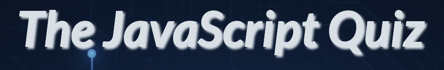
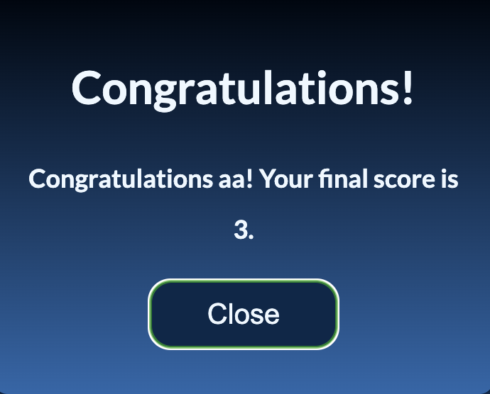

# JS Quiz

Visit the deployed site: [The JS-Quiz ](https://ann-anahit.github.io/JS-Quiz/)

The JS Quiz is a fun and educational JavaScript Quiz Game for students. Are you a student eager to delve into the world of JavaScript programming? Look no further than "JS-Quiz" – a captivating quiz game designed to make learning JavaScript both enjoyable and interactive. Say goodbye to dull textbooks and hello to a fun-filled learning adventure. With JS-Quiz, learning JavaScript becomes an exciting quest rather than a tedious chore.
Embark on your JavaScript learning journey with JS-Quiz today and unlock the door to endless coding possibilities!

## CONTENTS

* [User Experience](#user-experience-ux)
  * [User Stories](#user-stories)

* [Design](#design)
  * [Colour Scheme](#colour-scheme)
  * [Typography](#typography)
  * [Imagery](#imagery)
  * [Wireframes](#wireframes)
  * [Features](#features)
    * [The Home Page](#the-home-page)
    * [Future Implementations](#future-implementations)
  * [Accessibility](#accessibility)

* [Technologies Used](#technologies-used)
  * [Languages Used](#languages-used)
  * [Frameworks, Libraries & Programs Used](#frameworks-libraries--programs-used)

* [Deployment & Local Development](#deployment--local-development)
  * [Deployment](#deployment)
  * [Local Development](#local-development)
    * [How to Fork](#how-to-fork)
    * [How to Clone](#how-to-clone)

* [Testing](#testing)
  * [Solved Bugs](#solved-bugs)
  * [Known Bugs](#known-bugs)
  
* [Credits](#credits)
  * [Code Used](#code-used)
  * [Content](#content)
  * [Media](#media)
  * [Acknowledgments](#acknowledgments)

- - -

## User Experience (UX)

### User Stories

#### First Time Visitor Goals

* I want to be able to play at any time, anywhere.
* I want the site to be responsive to my device.
* I want the site to be easy to navigate.

#### Returning Visitor Goals

I want to be able to answer all the questions; if not, I can learn from my failures because the correct answer will be shown if I choose the incorrect one.

#### Frequent Visitor Goals

* I want to be able to log my high scores to see how I am performing.

- - -
[Back to top](<#contents>)

## Design

### Colour Scheme

I aimed to maintain the color scheme in blue to match the background image, which is predominantly blue. I chose white for the text color to ensure readability. Additionally, green and red were selected as answer colors.

* I have used `#102747` & `linear-gradient(#00050d, #3866a6)` as the primary and secondary colours used for the buttons, modal and footer background.
* I have used `#000000cc` as the overlay used over the sites background image.
* I have used `#800e32` to display the incorrect answers.
* I have used `#055d2c` to display the correct answers.
* I have used `##0D1C33` as the hovercolor for the buttons.
* I have used `#f0f8ff` for the text.

  

### Typography

Google-webfonts-helper was used to import the chosen font for use in the site.

* For the game I have used the google font [Lato](https://gwfh.mranftl.com/fonts/lato?subsets=latin).

I've chosen Lato sans-serif font for its clean lines, enhancing readability on screens. Its sleek design not only ensures a pleasant reading experience but also aligns well with the aesthetics of programming languages.

### Imagery

As the website is called JS-Quiz, I wanted to use an image for the page background of an abstract  digital background with a texture resembling technology circuit boards. Abstract backgrounds can add visual interest and attractiveness to the game, making it more engaging for players.

### Wireframes

Wireframes were created for mobile, tablet and desktop using balsamiq.

### Features

The website is comprised of a home page and an instruction page.

All Pages on the website are responsive and have:

* A favicon in the browser tab.

  
  

* The title of the site at the top of every page. This title also acts as a link back to the home page.
  

#### The Home Page

The home page ...

The how to play  button opens a page showing the user how to play the game. The page contains a close button which will close the page, and show the home page again.

At the outset, the player is prompted to enter their name in a modal window. Once the name is entered, the modal form disappears, initiating the start of the game.

At the end, another modal appears displaying a congratulatory message indicating that the player has won, along with the player's total score.

#### Future Implementations

In future implementations I would like to:

1. Integrate with Learning Platforms: Partner with educational platforms or institutions to integrate the quiz game into their curriculum or learning management systems, offering a supplementary tool for students to reinforce their knowledge of JavaScript.
2. Expand beyond quizzes and incorporate interactive tutorials or coding challenges to provide hands-on learning experiences for users to practice JavaScript concepts in a practical setting.

### Accessibility

* Using semantic HTML.
* Using a hover state on all buttons on the site to make it clear to the user if they are hovering over a button.
* Ensuring that everything is readeble.

## Technologies Used

### Languages Used

HTML, CSS, Javascript

### Frameworks, Libraries & Programs Used

* [Figma](https://figma.com/) - Used to create wireframes.

* [Git](https://git-scm.com/) - For version control.

* [Github](https://github.com/) - To save and store the files for the website.

* [GitPod](https://gitpod.io/) - IDE used to create the site.

* [google-webfonts-helper](https://gwfh.mranftl.com/fonts) - To import the fonts used on the website.

* [Google Developer Tools](https://developers.google.com/web/tools) - To troubleshoot and test features, solve issues with responsiveness and styling.

* [Favicon.io](https://favicon.io/) To create favicon.

* [coolors.co](https://coolors.co/) To create colour sheme.

* [Am I Responsive?](http://ami.responsivedesign.is/) To show the website image on a range of devices.

* [chatGPT](https://chat.openai.com/) - Used to generate questions for my quiz and to check the readme for spelling errors.

- - -
[Back to top](<#contents>)

## Deployment & Local Development

### Deployment

To Deploy the site using GitHub Pages:

1. Log in to GitHub.
2. Go to the repository for the project. 
3. Click the settings button.
4. Select **Pages** in the left navigation menu under Code and Automation.
5. From the source dropdown select main branch and root. Press the save button.
6. The site has been deployed. It may take a few minutes before the site goes live.

1. Login (or signup) to Github.
2. Go to the repository for this project, (https://github.com/).
3. Click the settings button.
4. Select pages in the left hand navigation menu.
5. From the source dropdown select main branch and press save.
6. The site has now been deployed, please note that this process may take a few minutes before the site goes live.

### Local Development

#### How to Fork

To fork the repository:

1. Log in (or sign up) to Github.
2. Go to the repository for the project, 
3. Click the Fork button in the top right corner.

#### How to Clone

To clone the repository:

1. Log in (or sign up) to GitHub.
2. Go to the repository for the project,
3. Click on the code button, select whether you would like to clone with HTTPS, SSH or GitHub CLI and copy the link shown.
4. Open the terminal in your code editor and change the current working directory to the location you want to use for the cloned directory.
5. Type 'git clone' into the terminal and then paste the link you copied in step 3. Press enter.

- - -
[Back to top](<#contents>)

## Testing

Please refer to [TESTING.md](TESTING.md) file for all testing carried out.

### Known Bugs

* One bug that I found is that if the player clicks on the restart button, the questions appear sporadically, and they are not consistently 12 questions.

- This is the console log description of the behavior:

  Current question index: 1, Questions answered: 7
  Moving to next question...
  Current question index: 2, Questions answered: 9
  Moving to next question...
  Current question index: 3, Questions answered: 11
  Moving to next question...
  Current question index: 4, Questions answered: 13

- - -

## Credits

### Code Used

I learned the JavaScript essentials from the Code Institute content.

* I used [this You Tube tutorial](https://www.youtube.com/watch?v=TAB_v6yBXIE&t=503s) and this page [W3Schools](https://www.w3schools.com/howto/howto_css_modals.asp)to learn how to create a modal dialog for the beginning and the end of the game.

* For the questions I used the following page [This Math(.random)](https://developer.mozilla.org/en-US/docs/Web/JavaScript/Reference/Global_Objects/Math/random) to further adapt the shuffle I had researched on W3Schools to work with the data I had.

* I learned various methods for working with arrays from this specified page: [Array Methods](https://javascript.info/array-methods)

* I used this Tutorial from CodeInstitute [JavaScript debugging tutor session](https://drive.google.com/file/d/1AE87BqXYPmvvP910Kiz17DcKQUvDSGWZ/view)https://drive.google.com/file/d/1AE87BqXYPmvvP910Kiz17DcKQUvDSGWZ/view

* - I used [Kera Cudmore's Quiz Arms Readme](https://github.com/kera-cudmore/TheQuizArms/blob/main/README.md) as an inspiration for my project's Readme.

### Content

All questions for my site were generated from Chat GPT.

All other content for the site, such as introduction messages and instructions were written by myself.

### Media

- [Page background image](https://de.vecteezy.com/vektorkunst/6826902-abstrakter-digitaler-hintergrund-mit-technologie-leiterplatten-textur-elektronischer-motherboard-illustration-kommunikation-und-engineering-konzept-vektor-illustration)

- [Favicon image](https://de.vecteezy.com/vektorkunst/21287803-javascript-datei-vektor-icon-design)

### Acknowledgments

I would like to acknowledge the following people:

*  - Kay Welfare - My cohort facilitator.
*  - My Code Institute Mentor Jubril Akolade.

* My sister Seda Afijan - Who has consistently reminded me to take breaks, recognizing how easily they slip our minds when deeply engrossed in study and work. I appreciate her for being such a supportive and caring person.

[Back to top](<#contents>)