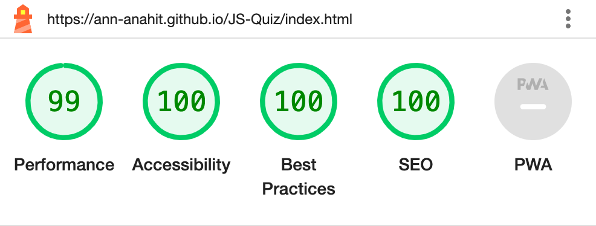

# The JS Quiz -  Testing

Visit the deployed site: [The JS-Quiz](https://ann-anahit.github.io/JS-Quiz/)

- - -

## CONTENTS

* [AUTOMATED TESTING](#automated-testing)
  * [W3C Validator](#w3c-validator)
  * [JavaScript Validator](#javascript-validator)
  * [Lighthouse](#lighthouse)
* [MANUAL TESTING](#manual-testing)
  * [Testing User Stories](#testing-user-stories)
  * [Full Testing](#full-testing)

Testing was ongoing throughout the entire build. I utilised Chrome developer tools whilst building to pinpoint and troubleshoot any issues as I went along.

I utilised the console in the developer tools to work through small sections of JavaScript and ensure that the code was working, and also to troubleshoot where issues were.

I have gone through each page using google chrome developer tools & Firefox inspector tool to ensure that each page is responsive on a variety of different screen sizes and devices.

- - -

## AUTOMATED TESTING

### W3C Validator

[W3C](https://validator.w3.org/) was used to validate the HTML on all pages of the website. It was also used to validate the CSS.

* [index.html](testing/w3/home-page-w3.png) - Passed.
* [instruction.html](testing/w3/instruction-page-w3.png) - Passed.

* [style.css](testing/w3/css-w3.png) - Passed, no errors found.

- - -

### JavaScript Validator

[jshint](https://jshint.com/) was used to validate the JavaScript.

* [javascript.js](testing/jshint/jshint1.png)- Passed.
  [javascript.js](testing/jshint/jshint2.png)- Passed.
  [javascript.js](testing/jshint/jshint3.png) - Passed.

- - -

### Lighthouse

I used Lighthouse within the Chrome Developer Tools to test the performance, accessibility, best practices and SEO of the website.

### Desktop Results

All pages of the site are achieving a score of 100 across the 4 categories.

### Mobile Results

- - -

## MANUAL TESTING

### Testing User Stories

`First Time Visitors`

| Goals | How are they achieved? |
| :--- | :--- |
| I want to be able to play at any time, anywhere. | The questions are educational. They are designed to test knowledge and understanding of JavaScript concepts and syntax. Each question focuses on a specific aspect of JavaScript, such as variable declaration, comments, functions, and comparison operators. Answering these questions correctly requires familiarity with JavaScript fundamentals, making them suitable for educational purposes, such as this quiz aimed at teaching JavaScript programming. |
| I want the site to be responsive to my device. | I have developed the site with responsiveness in mind. |
| I want the site to be easy to navigate. | Buttons are used throughout the site for navigation. - I have a small footer with social links. The page title also acts as a link to the home page.  |

`Returning Visitors`

|  Goals | How are they achieved? |
| :--- | :--- |
| Learning and improvement - The quiz offers valuable learning opportunities and challenges users to improve their JavaScript knowledge and skills, they may return to test themselves and track their progress. Providing informative feedback, explanations for correct answers, and opportunities for further learning can motivate users to come back for more.| The well-designed quiz with interesting questions, interactive features, and visually appealing design can keep users entertained and wanting to play again. |

`Frequent Visitors`

| Goals | How are they achieved? |
| :--- | :--- |
| I want to be able to adjust the difficulty level to keep improving my knowledge. | Users are able to select their own level of difficulty before the game begins. Once they have played they are free to select a different level of difficulty for subsequent games. |
| I want to be able to log my high scores to see how I am performing. | Users of the site are able to log their high scores to the high scores page. The top ten results will be displayed. |

- - -

### Full Testing

Full testing was performed on the following devices:

* Laptop:
  * Macbook Pro 2015 15' inch screen
* Mobile Devices:
  * iPhone 12 pro.
  * iPhone 11 pro.
 

Each device tested the site using the following browsers:

* Google Chrome
* Safari
* Firefox

Additional testing was taken by friends and family on a variety of devices and screen sizes. They reported no issues when playing.

`Home Page`

| Feature | Expected Outcome | Testing Performed | Result | Pass/Fail |
| --- | --- | --- | --- | --- |
| The Sites title | Link directs the user back to the home page | Clicked title | Home page reloads | Pass |
| The game starts with a modal. | The player writes their name and clicks on the start button. | If the player doesn't write a name, the window remains open. | Pass |
| How to play button | Here is the instruction page where are isntructions how to play the game | Clicked on button | The instruction page on how to play opens | Pass |
| Next button - clicked | When clicked a new question and answer loaded if there are questions left. If all 12 questions have been answered the end game modal should appear | Clicked on the next button | a new question and answers were displayed. After question 15 was answered I was taken to the end game. | Pass |
| Modal close button | Closes the modal | Clicked on close button | Modal closed | Pass |
| All buttons - hover effect | All  blue buttons with white text should change to dark blue background and the text stay white when hovered over. | Hover over each button on the page | Each button displayed the correct styling when hovered over | Pass |
| Correct answer - button colour | When a correct answer is clicked the button should change background colour to green | Clicked a correct answer | Button background turned green | Pass |
| Incorrect answer - button colour | When an incorrect answer is clicked the clicked buttons background should turn red | Clicked incorrect answer | Button background turned red | Pass |
| Incorrect answer - display correct answer | When an incorrect answer is clicked, the correct answer should display a green background | Clicked incorrect answer | The correct answer turned green | Pass |
| Question No counter | The Question No counter should start at 1 and increase by 1 time the next button is selected. | answered questions and clicked next button | Each time the next button is clicked the Answer no counter increases by 1. | Pass |
| Score Counter | The score counter should begin at 0. Each time a correct answer is selected the score should increase by 1. If an incorrect answer is selected the score should remain the same | Clicked a correct answer to check if the score increased. Clicked an incorrect answer to check the score stayed the same| When a correct answer was selected the score increased by 1. When an incorrect score was selected the score stayed the same | Pass |
| Restart button |when the Restart button is clicked the modal window should appears and the player should click again on start button to play  | Clicked on button | The modal window opens | Pass |
| Restart button |when the Restart button is clicked the score should begin at 0  | Clicked on button | The score begins at 0 | Pass |
| Restart button |when the Restart button is clicked the game should restart with the same instructions as before, (12 questions)  | Clicked on button | There are not consistently 12 questions | Fail |

`Instruction Page`

| Feature | Expected Outcome | Testing Performed | Result | Pass/Fail |
| --- | --- | --- | --- | --- |
| The Sites title | Link directs the user back to the home page | Clicked title | directed back to home page | Pass |
| Close button | when the close button is clicked the modal window should appears and the player should click again on start button to play   | Clicked the close button | Home page reloads | Pass |
